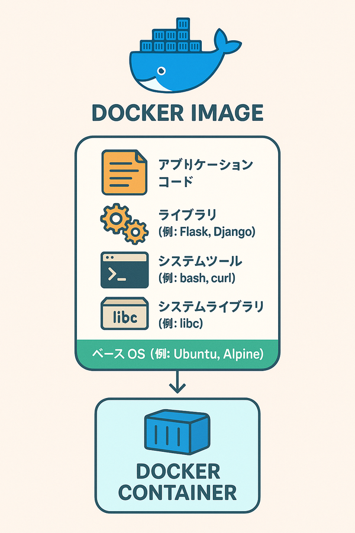

# Dockerのゆるふわ理解をぶっ壊す

日々、業務でもDockerを利用してるが、何となく忘れっぽいことや、ゆるふわ理解している部分をつらつらと書いて理解を深めていく

## buildContext

ビルドプロセス中にアクセスできるファイルセットのこと

`docker build` コマンドに指定する位置引数である

```bash
$ docker build [OPTIONS] PATH | URL | -
                         ^^^^^^^^^^^^^^
```

ビルドコンテキストが指定できるもの：

1. ローカルディレクトリへの相対パスまたは絶対パス
2. Gitリポジトリ、tarball、またはプレーンテキストファイルのリモートURL
3. 標準入力を通じて `docker build` コマンドにパイプされたプレーンテキストファイルまたはtarball(使ったことない)

すごく簡単に言うとビルドに必要なファイルやディレクトリを指定している。

dockerのビルド時には指定された

```bash
docker build -t myapp .
```

この `.` がビルドコンテキストであり、このコマンドの指定ではコマンドを叩いたディレクトリがビルドコンテキストになる。

dockerはこのビルドコンテキスト中のdockerfileを探しにいく。

もし違う階層のディレクトリにdockerfileが存在する場合は、-fオブションでdockerfileの場所を指定する。ビルドコンテキストからの位置を指定することになる。

```bash
docker build -f ./some/other/Dockerfile -t myapp .
```

**注意点としてはビルドコンテキストの外側はアクセスできない**

## docker buildコマンドのオプション


| **オプション** | **説明**                                          | **例**                     |
| ---------------- | --------------------------------------------------- | ---------------------------- |
| -t             | ビルドしたイメージに**名前（タグ）**を付ける      | -t myapp:latest            |
| -f             | **Dockerfileの場所** **を指定する**               | -f ./Dockerfile.prod       |
| --build-arg    | **ビルド時に渡す変数** **を指定する**             | --build-arg ENV=production |
| --no-cache     | **キャッシュを使わず** **ビルドする**             | --no-cache                 |
| --target       | **マルチステージビルド** **でステージを指定する** | --target builder           |
| --progress     | プログレス表示方法 (**auto**, **plain**, **tty**) | --progress=plain           |
| --platform     | ビルドする**プラットフォーム（OS/Arch）**を指定   | --platform=linux/amd64     |

### 基本形

```bash
docker build -t myapp .
```

カレントディレクトリ（.）をビルドコンテキストに
イメージ名は myapp

### dockerfileを指定してビルド

```bash
docker build -f ./Dockerfile.dev -t myapp-dev .
```

./Dockerfile.dev を使う
カレントディレクトリがコンテキスト

### ビルド引数（Build Args）を渡す

```bash
docker build --build-arg API_KEY=abcdef -t app-with-api .
```

Dockerfile内で ARG API_KEY として受け取れる

### キャッシュ無視でビルド

```bash
docker build --no-cache -t myapp-clean .
```

すべてクリーンな状態でビルドする

### まとめて指定

```bash
docker build \
  -f path/to/Dockerfile \
  -t my-image:tag \
  --build-arg KEY=VALUE \
  --no-cache \
  --platform linux/amd64 \
  .
```

## イメージ

dockerイメージとはコンテナを実行するために必要なファイル、バイナリ、ライブラリ、設定を含むパッケージである。



イメージの基本概念

* イメージはイミュータブルである。新しいイメージを作成するか、イメージを追加するのみ
* コンテナイメージはレイヤーで構成されている。レイヤーはファイルの追加、削除、変更を表している

コンテナの実行に必要な読み取り専用の設計図である

イメージはレイヤーで構成されている点がdockerfileを書くにあたって重要になる。

dockerのイメージは軽量な方が良いとされている。レイヤーごとにデータを持つため、レイヤーが多いほどイメージは重くなりがち。(1レイヤーが重い場合はこの限りではない->そもそも軽量化しよう
！)

またdockerはレイヤー単位で実行した結果をキャッシュしている.つまりレイヤーが多いほどキャッシュチェックも増え、オーバーヘッドが大きくなる。レイヤーが少ないほどビルドは速くなる。

**ポイント**

* 要は軽量なイメージを目指す上でレイヤーは少ない方がいい
* ビルド時のキャッシュを有効に利用して、チェックのオーバーヘッドも減らすためにレイヤーは少ない方がいい

ただ、レイヤーのキャッシュについては変更されたレイヤー以降のキャッシュは全て無効になるため、変更の少ないレイヤーを上位に記載して、変更が多いものは下位に記載した方がより有効である。OSなどのレイヤーは変更が少ないため上位に書いている
